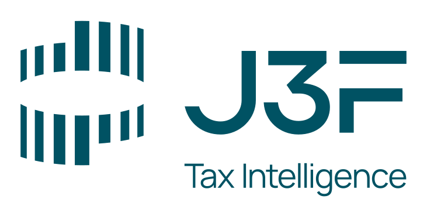

<div align="center">
  

  <h1>J3F Design System</h1>

  <p>
    <strong>Brand kit oficial e design tokens da J3F Consultoria | Tax Intelligence.</strong><br>
    Fonte única de verdade para identidade visual, tipografia, paleta e tom de voz.
  </p>

  <p>
    <a href="https://github.com/fabiosilva-labclaw/j3f-design-system/releases"></a>
    <a href="LICENSE"></a>
    <a href="LICENSE"></a>
    
  </p>
</div>

---

## Sobre

A J3F Consultoria é uma consultoria tributária brasileira com 25 anos de trajetória, especializada em inteligência fiscal, recuperação de créditos e auditoria consultiva. Este repositório consolida o **brand kit 2026** (versão 2026.1), entregue por Lucas Barreira em março de 2026, em formato consumível por código, ferramentas de design e modelos de linguagem.

**Conteúdo:**
- Tokens de design em 5 formatos (JSON, CSS, SCSS, TS, Python)
- Logotipos em SVG, PNG e PDF (CMYK)
- Fonte Manrope completa (7 pesos estáticos + variable font)
- Guia de tom de voz, manifesto e taglines oficiais
- Exemplos de aplicação prontos (assinatura de e-mail, card, paleta visual)

## Quick start

### Paleta primária

| Token | HEX | RGB | Uso |
|---|---|---|---|
| Verde Escuro | `#005263` | 0, 82, 99 | Headers, capas, fundos escuros |
| Teal | `#00ACCA` | 0, 172, 202 | Acentos, CTAs, links, gráficos |
| Verde Claro | `#96C9D7` | 150, 201, 215 | Backgrounds suaves, divisores |

### Paleta secundária

| Token | HEX | Uso |
|---|---|---|
| Cobre | `#9E947E` | Acento neutro quente |
| Bege Claro | `#EEE7D7` | Background quente, cards |
| Cinza | `#999999` | Texto secundário, captions |
| Preto | `#000000` | Texto corrido |
| Branco | `#FFFFFF` | Background principal |

### Tipografia

**Manrope** é a única fonte da marca. Pesos disponíveis: ExtraLight 200, Light 300, Regular 400, Medium 500, SemiBold 600, Bold 700, ExtraBold 800.

### Logotipo

Três variantes oficiais: Primário (logo + texto), Secundário (compacto), Isotipo (só símbolo). Cada uma em verde, branco e preto, com versões otimizadas para fundo claro e escuro.

## Como consumir

### CSS / HTML estático

```html
<link rel="stylesheet"
      href="https://raw.githubusercontent.com/fabiosilva-labclaw/j3f-design-system/main/tokens/brand.css">
```

```css
.botao-cta {
  background: var(--j3f-teal);
  color: var(--j3f-branco);
  font-family: var(--j3f-font-primary);
}
```

### SCSS

```scss
@import "j3f-design-system/tokens/brand";

.alerta { color: $j3f-verde-escuro; }
```

### TypeScript / JavaScript

```ts
import { colors, typography } from "j3f-design-system/tokens/brand";

const accent = colors.primary.teal.hex; // "#00ACCA"
```

### Python (Streamlit, scripts internos)

```python
from tokens.brand import COLORS, TYPOGRAPHY

st.markdown(f"<h1 style='color:{COLORS['verde_escuro']}'>J3F</h1>",
            unsafe_allow_html=True)
```

### Git submodule (para projetos J3F internos)

```bash
git submodule add https://github.com/fabiosilva-labclaw/j3f-design-system.git brand
```

### Como referência para Claude Design ou ferramentas IA

Aponte para este repositório no campo "Link code on GitHub" do Claude Design. O LLM consome `tokens/brand.json` (formato W3C Design Tokens) + `docs/` + `manifest.json` para entender a marca.

## Estrutura

```
j3f-design-system/
├── README.md                 ← você está aqui
├── LICENSE                   ← MIT (código) + proprietário (assets visuais)
├── CHANGELOG.md
├── CONTRIBUTING.md
├── manifest.json             ← metadata machine-readable da brand
├── package.json              ← consumo via npm
├── tokens/                   ← design tokens em 5 formatos
│   ├── brand.json            ← canônico (W3C Design Tokens)
│   ├── brand.css
│   ├── brand.scss
│   ├── brand.ts
│   └── brand.py
├── logos/
│   ├── svg/                  ← vetorial (preferencial)
│   ├── png/                  ← raster
│   ├── pdf/                  ← CMYK para impressão
│   └── avatar/               ← favicon, avatares sociais
├── fonts/manrope/            ← 8 arquivos TTF + OFL
├── docs/
│   ├── brand-summary.md      ← síntese executiva
│   ├── tom-de-voz.md         ← guia editorial
│   ├── color-palette.md
│   ├── typography.md
│   ├── logo-usage.md
│   └── manual.md             ← link para PDF canônico
├── examples/                 ← aplicações prontas em HTML
│   ├── color-showcase.html
│   ├── card-component.html
│   └── email-signature.html
└── .github/
    ├── workflows/pages.yml   ← deploy do site estático
    └── ISSUE_TEMPLATE/
```

## Regras inegociáveis

1. **Nunca recriar logos.** Usar apenas os arquivos em [logos/](logos/).
2. **Nunca aplicar logo no lado direito** do layout. Posições permitidas: superior/inferior esquerdo ou centralizado.
3. **Redimensionar logo sempre proporcionalmente.** Vedado skew, shear, achatamento ou esticamento.
4. **Manrope é a única fonte.** Georgia, Calibri, Playfair Display e DM Sans foram descontinuadas em 2025.
5. **Apenas a paleta J3F 2026.** Cores antigas (#505459, #54BFC3, #2C3E50, #D4A853, etc.) descontinuadas.
6. **Tom autoritário acessível.** Sem juridiquês, sem alarmismo, sem promessas milagrosas.

Detalhes em [docs/logo-usage.md](docs/logo-usage.md) e [docs/tom-de-voz.md](docs/tom-de-voz.md).

## Manual canônico

O **Manual de marca J3F 2026** (PDF, 60 páginas, 18 MB) é a fonte de verdade humana. Ficou fora do repo por tamanho. Acesso via iCloud Drive J3F ou solicitação direta a [fabio@j3f.com.br](mailto:fabio@j3f.com.br). Resumo executivo legível em [docs/brand-summary.md](docs/brand-summary.md).

## Versão e créditos

- **Versão atual:** 2026.1
- **Designer:** Lucas Barreira (março/2026)
- **Mantenedor técnico:** Fábio Garcia da Silva (OAB/SP 232.079)
- **Domínio:** [j3f.com.br](https://j3f.com.br)

Histórico em [CHANGELOG.md](CHANGELOG.md).

## Licença

Código (tokens, scripts, exemplos): [MIT](LICENSE).
Assets visuais (logos, símbolo, fontes customizadas, manual): proprietários da J3F Consultoria. Uso externo requer autorização escrita.

Manrope: distribuída sob [SIL Open Font License 1.1](fonts/manrope/OFL.txt).
